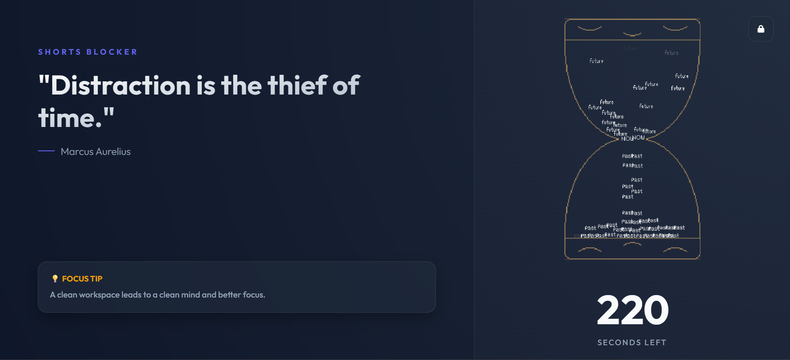

# FocusShield: Advanced Content & Distraction Blocker

**FocusShield** is a premium Chrome extension designed to help you reclaim your time from addictive short-form content. It goes beyond simple blocking by transforming your distraction moments into a sleek, focused environment that encourages mindfulness and deep work.

## 🚀 Key Features

- **Multi-Platform Blocking**: Automatically detects and blocks addictive feeds like YouTube Shorts and Instagram Reels.
- **Glassmorphism UI**: A stunning, modern interface with high-quality aesthetics, smooth animations, and a responsive layout.
- **Interactive Hourglass**: A custom-built sand-clock physics simulation that visually tracks your focus period.
- **Dynamic Insights**: Displays rotating motivational quotes and focus tips to keep you on track.
- **Secure Timed Locks**: Prevent yourself from disabling the blocker or changing settings for a fixed duration (up to 30 days) to enforce discipline.
- **Custom Block List**: Sanitize and add any website you find distracting with automatic protocol and trailing slash removal.
- **Smart Logic**: Automatically detects duplicate entries and provides real-time feedback.

## 🛠️ Technical Details

- **Core**: Vanilla JavaScript (ES6+), HTML5, CSS3.
- **Storage**: Chrome Storage API for persistent user settings and lock states.
- **Physics Engine**: Custom-built particle physics for the hourglass simulation.
- **Styling**: Modern CSS with glassmorphism, flexbox/grid layouts, and Font Awesome integration.

## 📥 How to Install

1.  **Clone or Download** this repository.
2.  Open Chrome and navigate to `chrome://extensions/`.
3.  Enable **Developer Mode** (top right toggle).
4.  Click **Load unpacked** and select the project folder.
5.  FocusShield is now active!

## ⚙️ Configuration

Click the **Gear Icon** in the top right corner of the blocker overlay to:
- Add or remove websites from your block list.
- Change the block duration.
- Activate the **Secure Lock** to commit to a distraction-free period.

---
Created with focus and productivity in mind by SimpleCyber.
